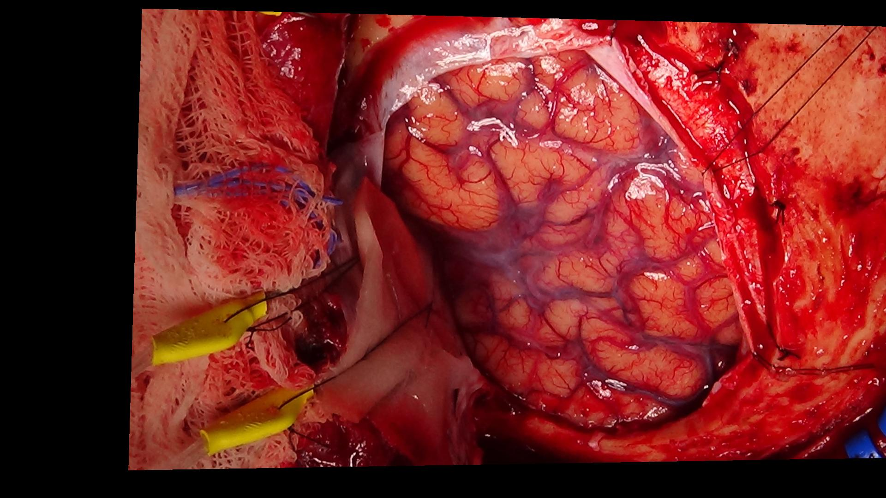

# **Intraoperative Image Registration Tools**

## **Overview**
This repository contains three open-source tools for aligning and registering intraoperative photographs captured from different positions and angles. These scripts provide robust methods for automatic and manual image registration, enabling researchers, clinicians, and developers to achieve precise image alignment for various applications, particularly in medical imaging. This tool is useful for identifying where ECoG electrodes are located based on intraoperative photography alone.

Image registration is critical for merging multiple images into a consistent framework, especially when images are captured under varying conditions. These tools offer flexibility with both automated and manual approaches in Python and MATLAB.

---

## **Features**
- **Automatic Registration (`IntraOp_Image_Registration_Automatic.py`):**
  - Detects and matches features between images using SIFT and ORB.
  - Computes transformations using RANSAC-based homography.
  - Outputs registered images, match visualizations, and transition GIFs.

- **Manual Registration in Python (`IntraOp_Image_Registration_Manual.py`):**
  - Enables user-defined control points through an interactive GUI.
  - Outputs registered images, point-match visualizations, and transition GIFs.

- **Manual Registration in MATLAB (`IntraOp_Image_Registration_Manual.m`):**
  - Provides manual control in MATLAB’s environment for selecting corresponding points.
  - Outputs registered images and visualizations with MATLAB-specific functionality.

---

## **Applications**
- Aligning intraoperative photos for overlay and analysis.
- Preparing datasets for computer vision and AI research.
- Supporting workflows where precise registration is critical.

---

## **Getting Started**

### **Prerequisites**
- Python 3.7+ (for Python scripts)
- MATLAB R2019b+ (for MATLAB script)

#### **Python Libraries**
Install the following Python libraries using pip:
```bash
pip install numpy opencv-python matplotlib imageio scipy
```

### **Installation**
1. Clone the repository:
   ```bash
   git clone https://github.com/yourusername/IntraOp_Image_Registration_Tools.git
   cd IntraOp_Image_Registration_Tools
   ```
2. Place your images in the working directory.

---

## **Usage**

### **1. Automatic Registration (Python)**
```bash
python IntraOp_Image_Registration_Automatic.py <path_to_reference_image> <path_to_target_image>
```
- Example:
  ```bash
  python IntraOp_Image_Registration_Automatic.py images/ref_image.jpg images/target_image.jpg
  ```
- Outputs:
  - Registered image.
  - Visualization of matched points.
  - Transition GIF showing the alignment.

---

### **2. Manual Registration (Python)**
```bash
python IntraOp_Image_Registration_Manual.py <path_to_reference_image> <path_to_target_image>
```
- Example:
  ```bash
  python IntraOp_Image_Registration_Manual.py images/ref_image.jpg images/target_image.jpg
  ```
- Follow the GUI to select corresponding points on both images.
- Outputs:
  - Registered image.
  - Visualization of selected points.
  - Transition GIF showing the alignment.

---

### **3. Manual Registration (MATLAB)**
1. Open `IntraOp_Image_Registration_Manual.m` in MATLAB.
2. Run the script:
   ```matlab
   IntraOp_Image_Registration_Manual
   ```
3. Select corresponding points interactively through MATLAB’s GUI.
4. Outputs include the registered image and a visualization of matched points.

---

## **Outputs**
- **Registered Image:** The aligned target image.
- **Match Visualization:** Shows corresponding points on the reference and target images.
- **Transition GIF:** A smooth animation of the alignment process (Python scripts only).

---

## **Examples**
### **Input Images**
1. **Reference Image (Grid):**
   
2. **Target Image (No Grid):**
   

### **Outputs**
1. **Registered Image:**
   

2. **Matched Points Visualization:**
   

3. **Transition GIF:**
   

---

## **License**
This repository is licensed under CC BY-NC 4.0. For commercial use, please contact the author.

---

## **Acknowledgments**
These tools were developed to support research in intraoperative imaging and are inspired by advancements in computer vision and image processing. Contributions and feedback are welcome to enhance this project further.

